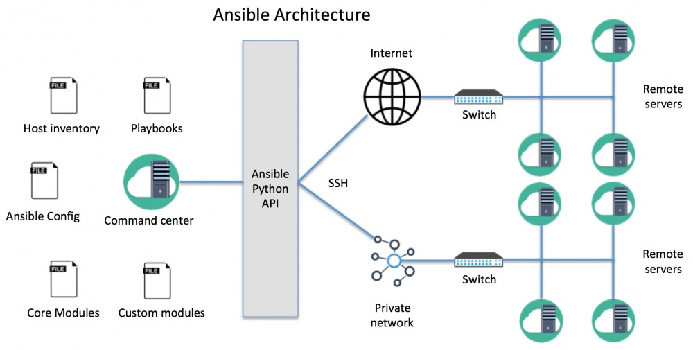

# Ansible

Для автоматизации настройки сборочных нод, установки и обновления ПО применяются роли Ansible.

## Как работает Ansible

Основная идея Ansible – наличие одного или нескольких управляющих серверов, из которых вы можете отправлять команды или наборы последовательных инструкций (playbooks) на удаленные сервера, подключаясь к ним по SSH.


В качестве управляющего сервера проще всего использовать сервер под управлением linux.

Для установки, на управляющем сервере введите:

``` bash
sudo apt-add-repository ppa:ansible/ansible
sudo apt-get update
sudo apt-get install ansible
sudo apt-get install python-pip git libffi-dev libssl-dev -y
pip install pywinrm

```

Также можно воспользоваться vagrant.

``` bash
vagrant up
vagrant ssh
cd /vagrant
```

TODO Набор файлов для Ansible

```bash
ansible.cfg - главный конфиг файл
inventory - файл с перечислением управляемых хостов
logs - каталог с логами выполнения задач
modules - каталог модулей
playbooks - каталог с плейбуками
playbooks\tasks - каталог с отдельными задачами
packadges - каталог для пакетов 1с
```

TODO либо как создавать ключи, либо как подложить уже существующие
Также необходимо сгенерировать на управляющем сервере ключ, который будет использоваться для доступа к настраиваемым серверам. 
Это делается с помощью команды

``` bash
ssh-keygen
```

На все вопросы можно просто нажать Enter.

Теперь необходимо скопировать публичный ключ на настраиваемые сервера.

Это можно сделать с помощью утилиты ssh-copy-id с управляющего сервера Ansible для каждого настраиваемого сервера:

``` bash
ssh-copy-id hostname|ip-adress
```

Для управления windows нодами ansible использует WinRM. Соответственно его необходимо корректно настроить.

Проверяем, запущен ли WinRM:

``` cmd
winrm enumerate winrm/config/listener
```

Если команда вернула пустой результат, необходимо включить WinRM следующей командой:

``` cmd
winrm quickconfig
```

Система запросит подтверждение на создание прослушивателя и добавление правила в брандмауэр. Соглашаемся, введя Y

Теперь запускаем от администратора обычную командную строку и вводим последовательно следующие 3 команды:

``` cmd
winrm set winrm/config/client/auth @{Basic="true"}
winrm set winrm/config/service/auth @{Basic="true"}
winrm set winrm/config/service @{AllowUnencrypted="true"}
```

После этого нужно вписать имя хоста или его ip адрес в [инвентарный файл](inventories/local/hosts)

TODO (что нужно заполнить обязательно?) А также заполнить следующие данные:

Проверим что есть связь:

``` bash
ansible test1 -m win_ping
ansible test1 -m setup
```

Проверим выполнение плейбука

``` bash
ansible-playbook playbooks/setup-win-node-add.yml --check
```

И применим его

``` bash
ansible-playbook playbooks/setup-win-node-add.yml
```

Для выполнения только некоторых шагов есть возможность использовать параметры `--tags` и `--skip-tags`

``` bash
ansible-playbook playbooks/setup-win-node-add.yml --tags "oscript"
```

Выполнятся только задачи с тегом oscript

``` bash
ansible-playbook playbooks/setup-win-node-add.yml --skip-tags "oscript"
```

Выполнятся все задачи кроме тех у которых указан тег oscript.

Список используемых тегов:

    allure
    choco
    registry
    services
    users
    vlc
    vnc
    winconfig

### Общая схема работы плейбука

Ко всем хостам группы add следующие роли: windowsconfig choco oscript allure add

### Последовательность работы

- На Jenkins мастере создать новую ноду
- Внести изменения в файл hosts
- Создать в папке `group_vars` файл в соответствии с именем ноды
- В созданном файле заполнить значение переменной `add_jenkins_slave_name`
- При необходимости переопределить значения переменных которые определены в `all`